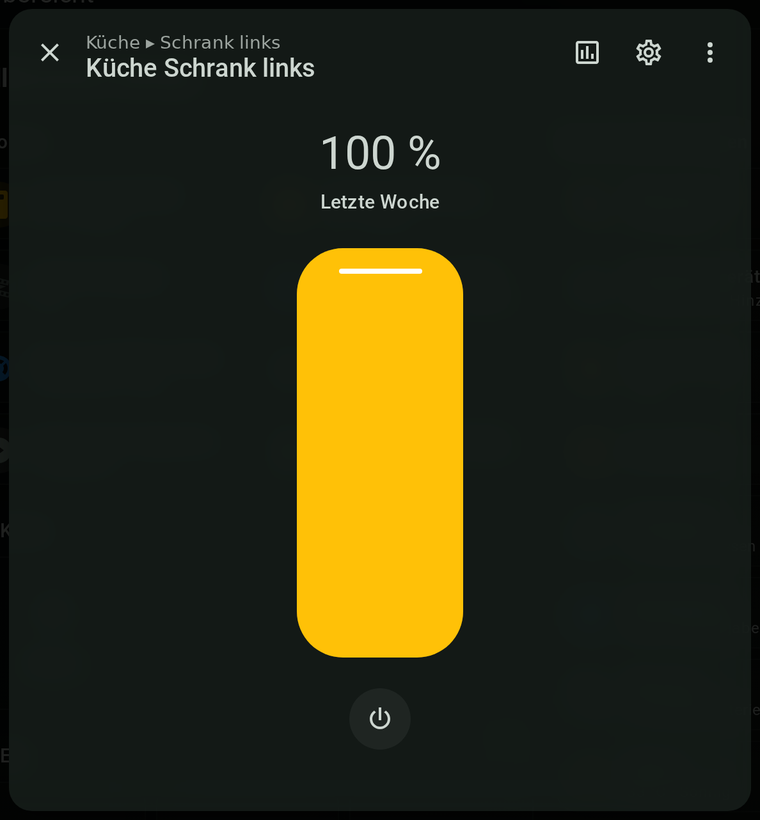
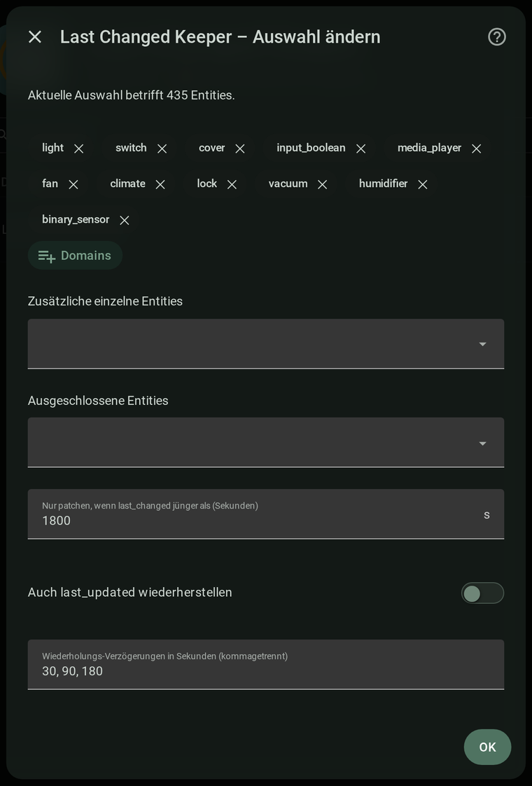

# Last Changed Keeper

Keeps the **real "last changed"** time of your entities after a Home Assistant
restart. Normally `last_changed` jumps to the restart time ("2 seconds ago"
instead of "17 minutes ago"); this integration restores the true time from the
recorder — directly on the entity, no extra sensors.

## Screenshots

  
  

A light on for over a week still shows *Letzte Woche* (last week) after a
restart, and the config dialog where you pick what to keep. *(German UI.)*

## How it works

On startup it reads the real start of each entity's current value from the
recorder (snapshot fallback for purged entities) and writes it back, skipping
restart artifacts (`unavailable`/`unknown`). Late-booting Zigbee/Z-Wave devices
are caught by a state listener and re-runs at +30/90/180 s. An entity is only
touched while it's "fresh" (grace, default 1800 s), so real usage isn't
overwritten. Cost is near zero: a short burst at boot, then idle.

## Installation (HACS)

1. Click the badge above (or HACS → Integrations → ⋮ → *Custom repositories* →
   this repo, category *Integration*).
2. Install, restart Home Assistant.
3. *Settings → Devices & Services → Add Integration* → "Last Changed Keeper".

## Configuration

Pick **domains**, single **entities**, **labels** and/or **areas** (labels/
areas cascade through devices, same as HA's built-in label/area target
selectors), an optional **exclude** list, the **grace** window, an optional
**periodic snapshot interval** (in addition to the one written on clean
shutdown — hedges against crashes/power loss), an optional **restore
`last_updated`** toggle, and the **retry delays**. Change it anytime via
*Configure*/*Reconfigure*.

Service `last_changed_keeper.restore_now` runs a pass on demand and
optionally returns a response (`patched`/`last_run`). Event
`last_changed_keeper_restored` fires once a pass settles (`final: true` in
the event data) — useful for automations that would otherwise race the
restore pass right after boot.

## Known limitations

- Requires the `recorder` integration (hard dependency); setup fails without it.
- Entities added after boot are only picked up on the *next* restart, not
  retroactively — a state genuinely changing while HA was down cannot be
  distinguished from a snapshot/recorder entry for the old value.
- If a value changed while Home Assistant was off, the timestamp restored at
  boot reflects the last known change *before* shutdown, not the (unknown)
  real change time during the outage.
- The bulk recorder lookback is 30 days; entities untouched for longer than
  that rely on the snapshot or a deeper per-entity query.

## Notes

Sets `last_changed` directly on the state object (no official API exists for
historical values); guarded defensively — on incompatibility it raises a repair
issue instead of crashing. Read-only towards the recorder.

## License

MIT — see [LICENSE](LICENSE).
